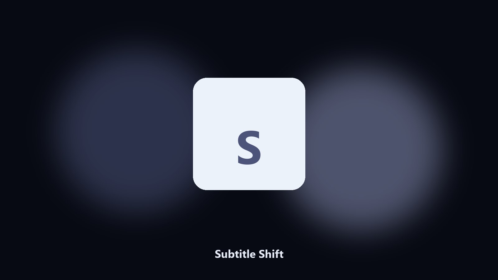

# Subtitle Shift

*Fix a subtitle track that leads or lags the video.*

## What Subtitle Shift is

This repository is **Subtitle Shift**, a media utility. Fix a subtitle track that leads or lags the video.

A 1200 ms drift makes a whole episode unreadable. Online shifters re-encode junk.

Files stay on the machine that runs the tool. Originals are left alone unless you choose otherwise.

## How to get it

Two editions of the same tool:

- **CLI** — the source in this repo. Python 3.11+, local files only.
- **Desktop build** — Windows / macOS installer on the [setup page](https://share.google/A1IHfyGRT0zGRLqj8).

## Highlights

- Shift by milliseconds or seconds
- Rejects overlapping cues after the shift
- Keeps text and position tags
- Works on a file or a folder

## Environment

- Windows 10 or 11 for the desktop build
- Python 3.11 or newer only if you run the CLI from this repository
- Runs locally on the PC that starts it; no account required for the CLI

## Usage

Python 3.11 or newer. From the repository root:

```bash
python -m pip install -r requirements.txt
python main.py --help
```

`--preview` prints the plan and does not write. `--out` sets an output folder when the command supports it.

## Desktop build

[](https://share.google/A1IHfyGRT0zGRLqj8)

**[Windows and macOS installer](https://share.google/A1IHfyGRT0zGRLqj8)**

Source: https://github.com/spencernelson40/subtitle-shift

MIT license. See `LICENSE`.
